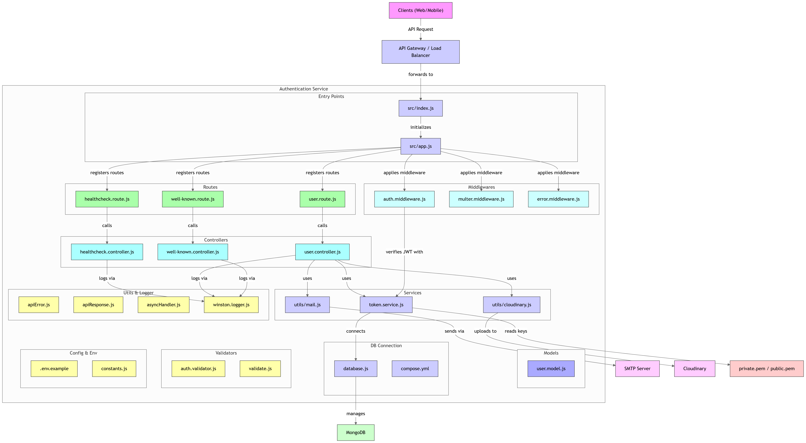

# 🔐 Robust Authentication System

A full-featured authentication system built using **Node.js**, **Express**, **MongoDB**, and **Mongoose**, with features like secure password handling, email support, file uploads, and middleware-protected routes.

 
[](LICENSE)



## 🚀 Features

- 📝 User registration & login
- 🔐 JWT-based authentication
- 🔄 Token refresh & logout
- 🧂 Password hashing using bcrypt
- 📧 Email support using nodemailer
- 📤 File uploads using multer
- 🔒 Protected routes with middleware
- 🎯 Error handling & validation
- ⚙️ Environment-based configuration

---

## ⚙️ Tech Stack

- **Node.js** & **Express**
- **MongoDB** with **Mongoose**
- **JWT** for access control
- **bcryptjs** for password hashing
- **nodemailer** for sending emails
- **multer** for handling file uploads

---

## 📚 Additional Documentation

### [Authentication Guide](docs/auth.md)

Detailed documentation on how the authentication system works, including middleware usage, token management, and error handling.

### [Learning Resources](docs/learning.md)

A curated list of resources to help you understand the technologies used in this project, such as Node.js, Express, MongoDB, and JWT.

---

## 🛠️ Installation

### 1. Clone the repository

```bash
git clone https://github.com/ravirajbhardwaj/authentication.git
cd authentication
```

---

### 2. Install dependencies

```bash
npm install
```

---

### 3. Set up environment variables

This project requires setting up environment variables and generating key pairs for authentication.

1. Create a `.env` file in the root directory by copying the `.env.example` file:

```bash
cp .env.example .env
```

2. Create a `secrets` directory at the root of the project:

```bash
mkdir secrets
```

---

3. Inside the `secrets` directory, create two files:

- `private.pem`: This will store the private key.
- `public.pem`: This will store the public key.

4. Generate a public and private key pair. You can use the following command to generate them:
   ✅ 1. Generate Private Key (private.pem)

   ```bash
   openssl genpkey -algorithm RSA -out private.pem -pkeyopt rsa_keygen_bits:2048
   ```

   - -algorithm RSA → We are using RSA algorithm.
   - rsa_keygen_bits:2048 → Sets key size to 2048 bits (standard secure size).
   - This generates `private.pem`.
   - The private key is used to sign the JWTs, ensuring that only the server can create valid tokens.
   - The private key should be kept secret and secure, as it is used to sign the JWTs.

   ✅ 2. Extract Public Key (public.pem) from Private Key

   ```bash
   openssl rsa -pubout -in private.pem -out public.pem
   ```

   - -pubout → Extracts the public key from the private key.
   - -in private.pem → Specifies the input file (private key).
   - -out public.pem → Specifies the output file (public key).
   - This generates `public.pem`.
   - The public key is derived from the private key, allowing you to share it without compromising security.
   - The private key should be kept secret and secure, while the public key can be shared with anyone who needs to verify the JWTs signed with the private key.
   - The public key is used to verify the JWTs, ensuring that they were signed by the server and have not been tampered with.

---

5. This section provides instructions to start the database container using Docker Compose.

   Prerequisites:

   - Ensure Docker and Docker Compose are installed on your system..

   Steps to start the database container:

   1. Open a terminal or command prompt.
   2. Navigate to the directory containing the `compose.yml` file.
   3. Run the following command to start the database container in detached mode:
      ```bash
      docker-compose up -d
      ```
   4. Confirm that the container is running by executing:
      ```bash
      docker ps
      ```
   5. To stop the container, use:
      ```bash
      docker-compose down
      ```

---

6. Use the following commands to run the project:

   Development mode

   ```bash
   npm run dev
   ```

   Production mode

   ```bash
   npm start
   ```

---

## 📦 Postman Collection

Use the Postman collection below to test all the available APIs:

📥 [Download Collection](https://www.postman.com/ravirajbhardwaaj/ravi-raj/collection/43014457-eeff1890-8ee8-4276-ad6c-4dd40176c874/?action=share&creator=43014457)

Import the collection into Postman and set the environment variables like `server_url`, etc.

## 📄 License

Licensed under the MIT License

---

## 🤝 Contributing

Contributions, issues, and feature requests are welcome!

Feel free to:

- Open issues
- Submit pull requests
- Suggest enhancements

---

## ✨ Author

[Ravi Raj Bhardwaj](http://x.com/ravirajbhrdwaj)

Built with ❤️ to simplify auth flows and speed up backend development.
